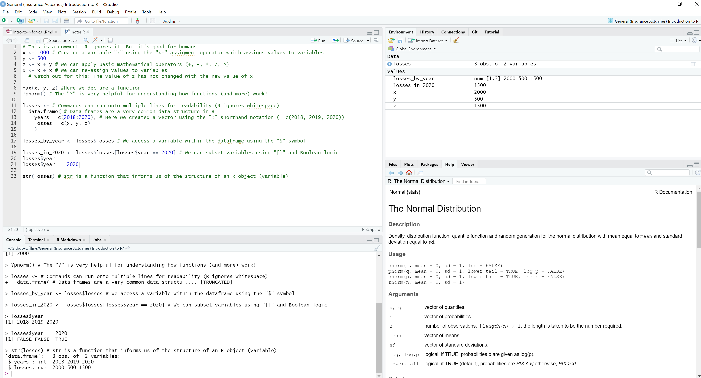

```{r setup, include=FALSE}
library(fontawesome) # For logos
```

# Why are we here? {data-background="intro-to-r-for-cs1_files/assets/abstract.jpg" .white .center}

- To pass the **CS1** *(Part B)* exam `r emo::ji("thumbs up")`
- To be persuaded that $R$ is great for actuarial work `r emo::ji("eyes")` ... maybe next time.

# The Basics `r fa("r-project", fill = "steelblue")` {data-background="intro-to-r-for-cs1_files/assets/coding.jpg" .white .center}
<span class="footnote">Yes ... it's `HTML`, not `R``r emo::ji("smirking face")`</span>

## Background `r emo::ji("books")`

This presentation is to help [IFoA](https://www.actuaries.org.uk/) actuaries tackle **Part B** of the **CS1** exam.

- Some **prerequisites**:
  - Understand the **CS1** [Actuarial Statistics](https://www.actuaries.org.uk/studying/curriculum/actuarial-statistics) material 
  - Install [`R`](https://cran.rstudio.com/)
  - Install [RStudio](https://rstudio.com/products/rstudio/download/#download)

## RStudio layout `r emo::ji("globe showing Europe-Africa")`



## R loves vectors `r emo::ji("red heart")`

R prefers **vectorised operations** (*over concepts like for loops*)

```{r vector-intro}
# This is the syntax for comments in R
(1:10) + 2 # Notice how we add element-wise in R
```

## R also loves variables `r emo::ji("heart with arrow")` { .leftAligned }

We **assign** values to **variables** using the `<-` *("assignment")* operator

```{r vector-variable, collapse=TRUE}
x <- 1:10
y <- x + 2
x <- x + x # Notice that we can re-assign values to variables
z <- x + 2
y
z
```

Even though $z$ is assigned the same way as we assigned $y$, note that $y \neq z$ so execution order matters in $R$

## Add power with functions `r emo::ji("rocket")`

We now add **functions** to the $R$ code which has the form `function_name(arguments = "values", ...)`{.R}

```{r vector2}
# Combine function, used often to create vectors:
x <- c(1:3, 6:20, 21:42) 
# Another function with arguments:
y <- sample(x, size = 3)
y
```

## Matrices `r emo::ji("classical building")`

Let's create a **matrix** in $R$

*Note:* **Matrix multiplication** requires the `%*%` syntax

```{r matrix1}
first_matrix <- matrix(1:9, byrow = TRUE, nrow = 3)
first_matrix %*% first_matrix
```

## Dataframes `r emo::ji("factory")` { .leftAligned }

A `data.frame` is a very popular data structure used in $R$. Each input variable has to have the same length but can be of different types (*strings, integers, booleans, etc.*).

```{r dataframes}
# Input vectors for the data.frame
name <- c("Mercury", "Venus", "Earth", "Mars", "Jupiter", "Saturn", "Uranus", "Neptune")
surface_gravity <- c(0.38, 0.904, 1, 0.3794, 2.528, 1.065, 0.886, 1.14)

# Create a data.frame from the vectors
solar_system <- data.frame(name, surface_gravity)
str(solar_system)
```

## Logical expressions `r emo::ji("alembic")`

R has built in logic expressions:

| Operator | Description |
|-|-|
| < (<=) | less than (or equal to) |
| > (>=) | greater than (or equal to) |
| == | exactly equal to |
| ! | NOT |
| & | AND (*element-wise*) |
| \| | OR (*element-wise*) |
| != | not equal to |

## Filtering and Subsetting `r emo::ji("microscope")` { .leftAligned }

We can use logical expressions to effectively filter data

Here we **subset** the data using the `[...]`{.R} syntax
```{r subsetting}
x <- 1:10
x[x != 5 & x < 7]
```

## Selecting objects `r emo::ji("microscope")` { .leftAligned }

We can select objects using the **\$** symbol - see `?Extract`{.R} for more help here

```{r selecting}
#data.frame[rows to select, columns to select]
solar_system[solar_system$name == "Jupiter", c(1:2)]
```

## Expand R with packages `r emo::ji("package")` { .leftAligned }

We can extend $R$'s functionality by loading **packages**:

```{r packages}
# Load the ggplot2 package
library(ggplot2)
```

- Did you get an error from $R$ trying this?
- To load packages they need to be **installed** first:
- `install.packages("ggplot2")`{.R}

## Importing data `r emo::ji("page with curl")` { .leftAligned }

We'll focus on exam likely candidates with `.csv` and `.RData` file imports

```{r import-data}
# Import csv files with read.csv() function:
csv_data <- 
  read.csv("intro-to-r-for-cs1_files/data/USTreasury_1YR.csv")

# For RData files, we use the load() function:
load("intro-to-r-for-cs1_files/data/USTreasury_10YR.RData")
```

`.txt` files can be loaded using the `read.table()`{.R} function

## Random Variables `r emo::ji("slot machine")`

$R$ was designed to be used for statistical computing - so it handles **randomness** well!

```{r random-variables}
set.seed(42) # Fixes result
die_throws <- sample(1:6, 10000, replace = TRUE)
mean(die_throws)
```

## Probability Distributions `r emo::ji("slot machine")`

- `R` has in-built functions for probability distributions:
  - **d***\<distribution-name\>* $:=$ **d**ensity (PDF), *i.e.* $f_X(x)$
  - **p***\<distribution-name\>* $:=$ **p**robability distribution cumulative function (CDF), *i.e.* $F_X(x) =\boldsymbol{P}(X \leq x)$
  - **q***\<distribution-name\>* $:=$ **q**uantile function, *i.e.* return $x$ such that $\boldsymbol{P}(X \leq x) = p$
  - **r***\<distribution-name\>* $:=$ **r**andom deviates, *i.e.* (*psuedo*) random number generator for a given distribution
  - *Where \<distribution-name\>* $=$ Normal, uniform, lognormal, Student's t, Poisson, binormal, Weibull ... see `?distributions()`{.R} for more information

## Probability Distributions Examples `r emo::ji("slot machine")`

| R Code | Definition |
|-|-|
| `rnorm(1)`{.R} | Generates $x_1$ where $X \sim \mathcal{N}(0,\,1)$ |
| `rnorm(y, mean=10, sd=2)`{.R} | Generates $\{y_1,\,y_2,\,\dots\}$ with $Y \sim \mathcal{N}(10,\,2^2)$ |
| `runif(3, min=5, max=10)`{.R} | Generates $\{z_1,\,z_2,\,z_3\}$  where $Z \sim \mathcal{U}(5,\,10)$ |
| `dbinom(4, size=5, prob=0.5)`{.R} | Computes $\boldsymbol{P}(X = 4)$ where $X \sim \mathcal{Bin}(5,\,0.5)$ |
| `pgamma(0.2, shape=2, rate=2)`{.R}<br><span class="footnote">*See footnote</span> | Computes $F_Y(0.2)$ where $Y \sim \mathcal{\Gamma}(2,\,2)$, i.e.  $\boldsymbol{P}(Y\leq 0.2)$|
| `qexp(0.5, rate = 2)`{.R} | Determines smallest value of $z$ for $\boldsymbol{P}(Z \leq z) = 0.5$ where $Z \sim Exp(2)$ |

<span class="footnote">\*This is how the $\Gamma$ distribution is parametrised in "*FORMULAE AND TABLES for EXAMINATIONS of THE INSTITUTE and FACULTY OF ACTUARIES*"</span>

# Data Analysis `r fa("r-project", fill = "steelblue")` {data-background="intro-to-r-for-cs1_files/assets/lagoon-nebula.jpg"}

## Exploratory Data Analysis `r emo::ji("microscope")`

`R` is great for calculating "*suitable summary statistics*"

```{r summary-stats}
x <- sample(1:100, 10)
summary(x)
sd(x) # Or: sqrt(var(x)) 
```

## Calculating correlations `r emo::ji("notebook")` { .leftAligned }

Let's calculate the "*Pearson’s, Spearman’s and Kendall’s measures of correlation for bivariate data*" using the `cor(x, y, method = "method-name")`{.R} function\*:

```{r correlation}
# Note: Data was loaded in the "Importing Data" section*
cor(
  x = csv_data$WGS1YR, 
  y = USTreasury_10YR$WGS10YR, 
  method = "pearson"
  )
```

<span class="footnote">\*Using the US Treasury data we loaded <a href="#/importing-data">here</a>.</span>

# Statistical inference `r fa("r-project", fill = "steelblue")` {data-background="intro-to-r-for-cs1_files/assets/stats.jpg" .center}

## Population mean confidence intervals `r emo::ji("telescope")` { .leftAligned }

Let's calculate confidence intervals for "*the mean ... of a normal distribution*" using Student's t-Test using the `t.test()`{.R} function:

```{r mean-confidence-intervals}
set.seed(42) # To fix result
# We create x_1, x_2, ... x_100 with X ~ N(0,1)
x <- rnorm(100)

# 99% CI for population mean:
as.vector(
  t.test(x, conf.level = 0.99)$conf.int
  )
```

## Population variance confidence intervals `r emo::ji("telescope")` { .leftAligned }

We can also calculate confidence intervals for "*the variance of a normal distribution*" using the $\chi^2$ distribution:

```{r variance-confidence-intervals}
set.seed(42) # To fix result
# We create x_1, x_2, ... x_100 with X ~ N(0,1)
x <- rnorm(100)

degrees_freedom <- length(x) - 1
sample_var_x <- var(x)
# 95% CI for population variance:
c(
  degrees_freedom * sample_var_x / qchisq(0.975, degrees_freedom),
  degrees_freedom * sample_var_x / qchisq(0.025, degrees_freedom)
)
```

## Simple linear regression `r emo::ji("satellite")` { .leftAligned }

Let's "*fit a simple linear regression model to a data set*" using the `lm(formula)`{.R} function and the symbolic syntax `predicted ~ explanatory(s)`{.R}

```{r linear-regression}
# Note: "women" is a built-in dataset in R
simple_linear_model <- lm(weight ~ height, data = women)
summary(simple_linear_model)$coefficients
```

We have a model for weight as:

weight = intercept$_{(-87.52)}$ + $\beta _{(3.45)}$ * height

## Multiple linear regression `r emo::ji("rocket")` { .leftAligned }

Let's expand this and "*fit a multiple linear regression model to a data set*" using the `lm()`{.R} function again, a `data.frame` as our data and the symbolic notation:

$\hat{Y} = \beta_0 + \beta_1X_1 + \beta_2X_2 + \,_{\dots}\, + \beta_nX_n$

```{r multiple-linear-regression, eval=FALSE}
# NOT EVALUATED
better_model <- lm(y ~ x1 + x2 + x3, data = data_set)
summary(multiple_linear_model) # Provides full results of the lm

# Residual standard error:
sigma(better_model) / mean(data_set$y)

# Compare models:
new_model <- lm(y ~ x1 + x2)
anova(better_model, new_model)
```

## Generalised linear models `r emo::ji("milky way")` { .leftAligned }

To "*fit a generalised linear model to a data set*" in $R$ we make use of the `glm()`{.R} function. Here we generalise:

- Predicted variable $Y$ follows a exponential **family** distribution
- Explanatory variables form a **linear predictor** $\beta_0 + \beta_1X_1, \, \beta_2X_2, \, \dots, \, \beta_nX_n$
- We link $Y$ and the linear predictor using a **link function**

```{r glm, eval=FALSE}
# NOT EVALUATED
glm_model <- 
  glm(formula = y ~ x1 + x2 + x3,
      family = Gamma(link = "inverse"), 
      data = data_set
      )
```

# Plotting `r fa("r-project", fill = "steelblue")`  {data-background="intro-to-r-for-cs1_files/assets/nebula.png"}

## Base plotting `r emo::ji("chart decreasing")` { .leftAligned }

We need to be able to "... *undertake exploratory data visualizations*", here we use the `plot()`{.R} function:

```{r base-plot-code, eval=FALSE}
plot(
    x = USTreasury_10YR$DATE, y = USTreasury_10YR$WGS10YR, # Data
    main = "10-Year Treasury Constant Maturity Rate", # Title
    sub = "Source: Board of Governors of the Federal Reserve System (US)",
    xlab = "Year", ylab = "Percent", # Axis labels
    type = "l" # Type of plot - here we use a l(ine) graph
  )
```

## Scatter plot `r emo::ji("chart decreasing")` 	

```{r base-plot, echo=FALSE}
plot(
    x = USTreasury_10YR$DATE, y = USTreasury_10YR$WGS10YR, # Data
    main = "10-Year Treasury Constant Maturity Rate", # Title
    sub = "Source: Board of Governors of the Federal Reserve System (US)",
    xlab = "Year", ylab = "Percent", # Axis labels
    type = "l" # Type of plot - here we use a l(ine) graph
  )
```

## Producing Q-Q plots `r emo::ji("chart decreasing")` { .leftAligned }

We can produce Q-Q plots using the `qqnorm()`{.R} and `qqplot()`{.R} functions. Add a theoretical line using the `qqline()`{.R} function.

```{r plot-qq-code, eval=FALSE}
# Note: "ToothGrowth" is a built-in dataset in R
qqnorm(ToothGrowth$len, 
       pch = 15, # plotting symbol
       col = "blue") # colour 

# Add a reference line:
qqline(ToothGrowth$len,
       col = "#FF0000", # can also use RGB
       lwd = 3) # line width
```

## Q-Q plot `r emo::ji("chart decreasing")` 

```{r plot-qq, echo=FALSE}
qqnorm(ToothGrowth$len, pch = 15, col = "blue")
qqline(ToothGrowth$len, col = "#FF0000", lwd = 3)
```

## Producing historgrams `r emo::ji("chart decreasing")` 

Histograms can be generated using the `hist()`{.R} function:

```{r plot-histogram-code, eval=FALSE}
set.seed(42) # Fix the result

# Histogram of random draws from the t-distribution
hist(rt(1000, df = 10), 
     # Use breaks argument to (optionally) control the binning
     breaks = seq(from=-5, to=5, by=0.5),
     col = rgb(173,216,230,80, max = 255), # Colour
     main = "Histogram of random draws from t-distribution",
     xlab = "Value"
     )

# Add second histogram
y <- rt(1000, df = 20)
hist(y, col = rgb(255,192,203,80, max = 255), breaks = 21,
     add = TRUE) # Add onto existing plot
```

## Histogram `r emo::ji("chart decreasing")` 

```{r plot-histogram, echo=FALSE}
set.seed(42) # Fix the result

# Histogram of random draws from the t-distribution
hist(rt(1000, df = 10), 
     # Use breaks argument to (optionally) control the binning
     breaks = seq(from=-5, to=5, by=0.5),
     col = rgb(173,216,230,80, max = 255), # Colour
     main = "Histogram of random draws from t-distribution",
     xlab = "Value"
     )

# Add second histogram
y <- rt(1000, df = 20)
hist(y, col = rgb(255,192,203,80, max = 255), breaks = 21,
     add = TRUE) # Add onto existing plot
```

## Plotting with ggplot2 `r emo::ji("chart increasing")` { .leftAligned }

Plot with `ggplot()`{.R} in `libary(ggplot2)`{.R}, defining your aesthetics with `aes()`{.R} and the type of chart with the `geom_()`{.R} functions and you might become a [data journalist](https://bbc.github.io/rcookbook/)

```{r ggplot-code}
# Join datasets together: csv_data (treating Date format) and USTreasury_10YR
yield_data <- data.frame(DATE = as.Date(csv_data$DATE), yield_rate = csv_data$WGS1YR, term = "1 year")
yield_data <- rbind(yield_data, 
                    data.frame(DATE = USTreasury_10YR$DATE, yield_rate = USTreasury_10YR$WGS10YR, term = "10 year"))

library(ggplot2)
caption <- "Source: Board of Governors of the Federal Reserve System (US)"
p <- ggplot(yield_data, 
            aes(x = DATE, y = yield_rate, colour = term)
            ) +
  geom_line() +
  labs(x = "", colour = "Term", y = "Percent",caption = caption) +
  ggtitle("1-Year and 10-Year Treasury Yield Curve Rates") + 
  theme_bw()
```

## ggplot2 Plot `r emo::ji("chart increasing")`

```{r ggplot, echo=FALSE}
p
```

# CS1 Actuarial Examples {data-background="intro-to-r-for-cs1_files/assets/galaxy.jpg"}

## CS1 Question 1 `r emo::ji("notebook with decorative cover")` { .leftAligned }

- *Given a sample from $X \sim \mathcal{N}(\mu,\,\sigma^{2})$,*

1. *Calculate the sample mean, $\bar{x}$*

2. *Calculate a 95% confidence interval ("CI") for $\mathbb{E}[X]$*

3. *Calculate a 95% CI for $\mathbb{E}[X]$ using a bootstrap method with a sample size of 10,000*

## CS1 Question 1: Answer (Part 1) `r emo::ji("book")`  { .leftAligned }

```{r q1-answer-part1}
# We have X equal to:
x <- 
  c(0.20, 0.40, 1.20, 0.55, 0.75, 
    1.10, 0.50, 0.70, 0.55, 0.60, 
    0.65, 0.55, 0.50, 0.50, 0.45, 
    0.65, 0.55, 0.30, 0.50, 0.45
    )

# 1. Expected value of X is:
mean(x)
```

## CS1 Question 1: Answer (Part 2) `r emo::ji("book")`  { .leftAligned }

Given $X \sim \mathcal{N}(\mu,\,\sigma^{2})$ with unknown population variance, a 95% CI for $\mathbb{E}[X]$ is:

```{r q1-answer-part2}
confidence_level <- 0.95
confidence_interval <- 
  c(
    (1 - confidence_level)/2,
    1 - (1 - confidence_level)/2
    )
degrees_freedom <- length(x) - 1
critical_value <- qt(confidence_interval, degrees_freedom)
mu <- mean(x)
sigma <- sqrt(var(x))

c(
  mu - abs(critical_value[1]) * sigma / sqrt(length(x)),
  mu + abs(critical_value[1]) * sigma / sqrt(length(x))
)
```

## CS1 Question 1: Answer (Part 3) `r emo::ji("book")`  { .leftAligned }

We can also calculate a 95% CI for $\mathbb{E}[X]$ using a bootstrap method:

```{r q1-answer-part3}
set.seed(42)
sample_size <- 10000
confidence_level <- 0.95
confidence_interval <- 
  c(
    (1 - confidence_level)/2,
    1 - (1 - confidence_level)/2
  )
x_bootstrapped <- 
  replicate(sample_size,
            mean(sample(x, replace = TRUE))
            )
quantile(x_bootstrapped, probs = confidence_interval)
```

## CS1 Question 2 `r emo::ji("notebook with decorative cover")`  { .leftAligned }

- *Given the dataset "house_data.csv" (given below)*:

1. *Fit a generalised linear model to predict house prices using a Gamma distribution*

2. *State the formula of the model fitted*

3. *Review the model fit*

```{r q2-question}
house_data <- read.csv("intro-to-r-for-cs1_files/data/house_data.csv")
head(house_data[,-c(1,8:11)]) # Glimpse of data set
```

## CS1 Question 2: Answer (Part 1) `r emo::ji("book")`  { .leftAligned }

Let's build a GLM with response variables "*YearBuilt*", "*HouseSize*" and "*RoofType*":

```{r q2-answer-part1}
glm_model <- glm(
  Price ~ YearBuilt + HouseSize + RoofType,
  family = Gamma(link = "inverse"),
  data = house_data
)
```


## CS1 Question 2: Answer (Part 2) `r emo::ji("book")`  { .leftAligned }

```{r q2-answer-part2}
coef(glm_model)
```

We have fit a model with $\bar{\nu} = \frac{1}{\mu} =$ 12,772 $-$ 28,635,925$x_1 \,-$ 498,345,682$x_2 \,+$ 158,657,830$x_3$

where $\bar{\nu}$ is the predicted variable *"Price"* and $x_1,\, x_2,\, x_3$ are the *"YearBuilt"*, *"HouseSize"* and *"RoofType"* variables respectively.

## CS1 Question 2: Answer (Part 3) `r emo::ji("book")`  { .leftAligned }

```{r q2-answer-part3}
summary(glm_model)
```
*"YearBuilt"* and *"HouseSize"* parameters are significant at the 0.1% level

# Final remarks {data-background="intro-to-r-for-cs1_files/assets/starry-night.jpg"}

## Where to get more help `r emo::ji("SOS button")`

- Some recommendations:
  - RStudio:
    - Built-in cheat sheets *(Help -> Cheatsheets)*
    - Package documentation and the `help()`{.R} function
    - Tutorials via `library(learnr)`{.R} package
  - DataCamp's free course: [Introduction to R](https://www.datacamp.com/courses/free-introduction-to-r)
  - IFoA's [guide](https://www.actuaries.org.uk/system/files/field/document/R-Guide_technical.pdf) on "*get up and running with R*"
  
## Why not use Python? `r fa("python", fill = "green")`  {.center}

- Sure, go for it!
- Use the right tool(s) for *your* problem\*
- \*Aspire to Jeff Bezos' [Regret Minimization Framework](https://www.youtube.com/watch?v=jwG_qR6XmDQ)

## What next? `r emo::ji("next track button")`

- R is incredibly powerful: this presentation was built with R\*, consider:
  - Using the `library(tidyverse)`{.R} suite of packages: enhancing your experience with `R`
  - Writing `R` code within a `RMarkdown` (*.Rmd*) file: good for report writing
  - Integrating `R` with `Git`: use the **Terminal** to interact with a remote repo from the command line
  - Creating interactive applications in `R` using `Shiny`

<span class="footnote">*With heavy assistance from <code>reveal.js</code> and in hindsight I should have used the right tool for the right job ... maybe next time `r emo::ji("smirking face")`</span>

# The End {data-background="intro-to-r-for-cs1_files/assets/blackhole.png" .white .leftAligned .center}

Download: [HTML presentation](https://github.com/alexgarbiak/presentations/archive/intro-to-r-for-cs1.zip)

View: [Source code](https://github.com/alexgarbiak/presentations/tree/intro-to-r-for-cs1)